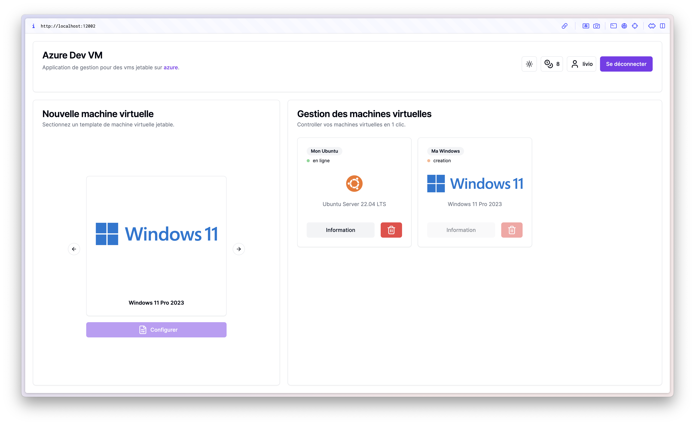

# Azure Dev VM

.

Le projet consiste en la réalisation d’une application web pour que les
développeurs puissent avoir facilement des environnements jetables de
tests et d’évaluation de leurs logiciels. L’idée est qu’un développeur qui
veut tester son application sous Linux ou Windows par exemple, puisse venir sur
notre application Web, qu’il crée et accède facilement à un Linux via SSH ou Windows via
RDP, et qu’il n’ait pas à s’occuper des détails de la machine virtuelle. Il a juste
commandé une machine virtuelle, a testé son application et s’est
déconnecté.

## Prérequis

- [JDK 21](https://www.oracle.com/java/technologies/javase/jdk21-archive-downloads.html)
- [Maven](https://maven.apache.org/)
- [Docker](https://www.docker.com/)
- Avoir les 3 logiciels dans le `PATH`

## Utilisation

### Acceder à l'application web
Vous pouvez accéder à l'application web via le lien suivant: [http://localhost:12002](http://localhost:12002)

### Regles applicatives

#### Roles
- **ADMIN**: Gestions des machines virtuelles de tout les utilisateurs
- **ADVANCED**: Peut lancer simultanément 2 machines virtuelles.
- **BASIC**: Peut lancer une machine virtuelle à la fois.

#### Gestions des seuils des machines virtuelles

Les variables d'environnements suivantes permettent de gérer les seuils des machines virtuelles dans le backend:
- `MAX_VMS_GLOBAL`: Nombre maximum total de machines virtuelles que peut lancer l'application
- `MAX_VMS_ROLE_BASIC`: Nombre maximum de machines virtuelles que peut lancer un utilisateur de role **BASIC**
- `MAX_VMS_ROLE_ADVANCED`: Nombre maximum de machines virtuelles que peut lancer un utilisateur de role **ADVANCED**
- `MAX_VMS_ROLE_ADMIN`: Nombre maximum de machines virtuelles que peut lancer un utilisateur de role **ADMIN**

#### Gestions des identifiants Azure

Les variables d'environnements suivantes permettent de gérer les identifiants Azure dans le backend:
- `AZURE_CLIENT_ID`: Identifiant client de l'application Azure
- `AZURE_CLIENT_SECRET`: Secret client de l'application Azure
- `AZURE_TENANT_ID`: Identifiant du locataire Azure
- `AZURE_SUBSCRIPTION_ID`: Identifiant de l'abonnement Azure

### Gestions des identités utilisateurs

Par défault:
- L'identifiant de l'administrateur est `admin` avec le mot de passe `admin` avec 10 tokens
- L'identifiant de l'utilisateur de role **ADVANCED** est `livio` avec le mot de passe `livio` avec 10 tokens
- L'identifiant de l'utilisateur de role **BASIC** est `abou` avec le mot de passe `abou` avec 10 tokens
- L'identifiant de l'utilisateur de role **BASIC** est `antho` avec le mot de passe `antho` avec 0 tokens

Pour changer les identifiants, il faut modifier le fichier [import.sql](backend/src/main/resources/import.sql) dans le backend.

### Les tokens

Les tokens sont utilisés pour lancer les machines virtuelles. Chaque utilisateur a un nombre de tokens qui lui est attribué. Lorsqu'un utilisateur lance une machine virtuelle, un token lui est retiré.

### Auto suppression des machines virtuelles

Par défaut, les machines virtuelles sont supprimées après 10 minutes.

## Installation

- Cloner le projet
- Aller dans le répertoire backend

Éxecuter la commande suivante pour compiler le backend
```bash
mvn clean install
```

## Exécution

- Aller dans le répertoire racine du projet
- Éxecuter la commande suivante pour démarrer l'application
```bash
docker-compose up
```